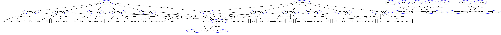

# Knowledge Base Represented by Semantic Web Language
Semantic Web languages OWL and RDF for Knowledge representation of Alarm-Warning System.

### Reference to:
[1] Valentyn N Sichkar. Semantic Web languages OWL and RDF for knowledge representation // GitHub platform [Electronic resource]. URL: https://github.com/sichkar-valentyn/Knowledge_Base_Represented_by_Semantic_Web_Language (date of access: XX.XX.XXXX)

## Description
The Semantic Web languages OWL and RDF enable knowledge representation by means of a Knowledge Base, i.e., a knowledge repository - not just a database. Knowledge Base consists of two parts: ontology and individuals, i.e., instances of classes in the ontology. Created Alarm-Warning System shows the statements of the System according to the values of sensors in given time. Types of used notations: _N3, json, latex, owl, owl Manchester, owl functional, rdf, turtle._

## Content
Codes (it'll send you to appropriate file):
* [N3_notation](https://github.com/sichkar-valentyn/Knowledge_Base_Represented_by_Semantic_Web_Language/blob/master/KB_in_Notation.n3)
* [triples](https://github.com/sichkar-valentyn/Knowledge_Base_Represented_by_Semantic_Web_Language/blob/master/KB_in_Triples)
* [json](https://github.com/sichkar-valentyn/Knowledge_Base_Represented_by_Semantic_Web_Language/blob/master/KB_in_json.owl)
* [latex](https://github.com/sichkar-valentyn/Knowledge_Base_Represented_by_Semantic_Web_Language/blob/master/KB_in_latex.owl)
* [owl](https://github.com/sichkar-valentyn/Knowledge_Base_Represented_by_Semantic_Web_Language/blob/master/KB_in_owl.owl)
* [owl_Manchester](https://github.com/sichkar-valentyn/Knowledge_Base_Represented_by_Semantic_Web_Language/blob/master/KB_in_owl_Manchester.owl)
* [owl_functional](https://github.com/sichkar-valentyn/Knowledge_Base_Represented_by_Semantic_Web_Language/blob/master/KB_in_owl_functional.owl)
* [rdf](https://github.com/sichkar-valentyn/Knowledge_Base_Represented_by_Semantic_Web_Language/blob/master/KB_in_rdf.owl)
* [turtle](https://github.com/sichkar-valentyn/Knowledge_Base_Represented_by_Semantic_Web_Language/blob/master/KB_in_turtle.owl)

 
Experimental results (figures on this page):

* <a href="#Concept map for organizing and representing knowledge">Concept map for organizing and representing knowledge</a>
* <a href="#Graphical representation of knowledge from .owl file with EasyRDF Converter">Graphical representation of knowledge from .owl file with EasyRDF Converter</a>

 
Theory (on this page):

* <a href="#Semantic Web Stack">Semantic Web Stack</a>
* <a href="#Uniform Resource Identifier">Uniform Resource Identifier</a>
* <a href="#Resource Description Framework RDF">Resource Description Framework RDF</a>
* <a href="#Resource Description Framework Schema RDFS">Resource Description Framework Schema RDFS</a>
* <a href="#Web ontology language">Web ontology language</a>
* <a href="#Descriptive logic and its application">Descriptive logic and its application</a>
* <a href="#Notations we can use in RDF">Notations we can use in RDF</a>
* <a href="#Terse RDF triple language (TURTLE) notation">Terse RDF triple language (TURTLE) notation</a>
* <a href="#SPARQL Protocol and RDF Query Language as protocol, data transmition schema">SPARQL Protocol and RDF Query Language as protocol, data transmition schema</a>
* <a href="#SPARQL language, types of query">SPARQL language, types of query</a>

 

### <a name="Concept map for organizing and representing knowledge">Concept map for organizing and representing knowledge</a>
Words on the line, referred to as linking words or linking phrases, specify the relationship between the two concepts.

### <a name="Graphical representation of knowledge from .owl file with EasyRDF Converter">Graphical representation of knowledge from .owl file with EasyRDF Converter</a>

### <a name="Semantic Web Stack">Semantic Web Stack</a>
The Semantic Web Stack (SWS) is illustration of the hierarchy of languages, where each layer uses capabilities of the layers below. It shows how technologies that are standardized and organized for Semantic Web (SW) to make the SW possible. The SW, from its side, provides a common framework that allows data to be shared and reused across application, enterprise, and community boundaries.

As shown in the SWS, the following languages or technologies are used to create SW. The technologies from the bottom of the stack up to OWL are currently standardized and accepted to build SW applications. It is still not clear how the top of the stack is going to be implemented.

### <a name="Uniform Resource Identifier">Uniform Resource Identifier</a>
A Uniform Resource Identifier (URI) is a sequence of characters that identifies a logical or physical resource. Such identification enables interaction with representations of the resource over a network. The URI generic syntax consists of a hierarchical sequence of five components:

URI = scheme:[//authority]path[?query][#fragment]

There are two types of URI:

* Uniform Resource Locator (URL)
* Uniform Resource Name (URN)

URL – this type of URI begins by stating which protocol should be used to locate and access the physical or logical resource on a network. If the resource is a web page, for example, the URI will begin with the protocol HTTP. For example, the URL http://example.org/sample/main_page.html refers to a resource identified as /sample/main_page.html whose representation is in the form of HTML and related code is obtainable via the Hypertext Transfer Protocol (http:) from a network host whose domain name is example.org.

URN – this type of URI labels the resource with a persistent, location-independent unique identifier. The URN will identify the resource throughout its lifecycle and will never change. Each URN has three components: the label “urn” a colon and a character string that serves as a unique identifier. For example, some book has its own ISBN number. The URN for that book can be:

urn:isbn:0-486-27557-4

### <a name="Resource Description Framework RDF">Resource Description Framework RDF</a>
Resource Description Framework (RDF) is a framework for creating statements in a form of so-called triples. It enables to represent information about resources in the form of graph - the semantic web is sometimes called Giant Global Graph.

RDF is based on the idea of making statements about resources (in particular web resources) in expressions of the form <b>subject–predicate–object</b>, known as triples. The subject denotes the resource, and the predicate denotes features of the resource, and expresses a relationship between the subject and the object. For example, one way to represent the notion "The sky has the color blue" in RDF is as the triple: a subject denoting "the sky", a predicate denoting "has the color", and an object denoting "blue".

Another example of RDF written in N3 notation:

@prefix : <http: www.example.org> .
 :john a :Person .
 :john :hasMother :helga .
 :john :hasFather :henrich .
 :richard :hasSister :jane .

The set of RDF-statements forms an oriented graph in which the vertices are subjects and objects, and the edges represent relations. However, in practice, RDF data is often stored in relational database or native representations (also called Triplestores). To process RDF data, it is proposed to implement query languages, such as SPARQL.

### <a name="Resource Description Framework Schema RDFS">Resource Description Framework Schema RDFS</a>
Resource Description Framework Schema (RDF Schema) is a set of classes with certain properties using by RDF. It provides basic elements for the description of ontologies, otherwise called RDF vocabularies, intended to structure RDF resources. These resources can be saved in a Triplestore to reach them with the query language SPARQL. Using RDFS it is for example possible to create hierarchies of classes and properties.

A typical example of an <b>rdfs:Class</b> is <b>foaf:Person</b> in the Friend of a Friend (FOAF) vocabulary. An instance of <b>foaf:Person</b> is a resource that is linked to the class <b>foaf:Person</b> using the <b>rdf:type</b> property, such as in the following formal expression of the natural-language sentence: 'John is a Person'.

ex:John rdf:type foaf:Person

Properties are instances of the class <b>rdf:Property</b> and describe a relation between subject resources and object resources. For example, the following declarations are used to express that the property <b>ex:employer</b> relates a subject, which is of type <b>foaf:Person</b>, to an object, which is of type foaf:Organization:

ex:employer rdfs:domain foaf:Person
 ex:employer rdfs:range foaf:Organization

Another example about dogs and cats is shown on the figure below.

Popular RDF vocabularies represented in RDFS include:

* FOAF
* Dublin Core
* Schema.org
* Simple Knowledge Organization System (SKOS)

### <a name="Web ontology language">Web ontology language</a>
Web Ontology Language (OWL) extends RDFS by adding more advanced constructs to describe semantics of RDF statements. It allows stating additional constraints, such as for example restrictions of values. It is based on description logic and so brings reasoning power to the semantic web.

On the basis of the language is the representation of reality in the <b>“object-property”</b> data model. OWL is suitable for describing not only web pages, but also any objects of reality. Each element of the description in this language (including the properties that connect the objects) is mapped to a URI (Uniform Resource Identifier).

The data described by an ontology in the OWL family is interpreted as a set of <b>"individuals"</b> and a set of <b>"property assertions"</b> which relate these individuals to each other.

Consider an ontology based on a description of a person. First, ontology identifiers are needed. Every OWL ontology must be identified by a URI (http://www.example.org/tea.owl, say). This example provides a sense of the Turtle syntax.

@prefix eric:    <http://www.example.org/people #> .
 @prefix contact: <http://www.example/contact#> .
 @prefix rdf:     <http://www.example.org/rdf#> .
 eric:me contact:fullName "Eric Miller" .
 eric:me contact:mailbox <mailto:e.miller123(at)example> .
 eric:me contact:personalTitle "Dr." .
 eric:me rdf:type contact:Person .

At the moment, the second version of the OWL language is considered to be relevant, which defines the following varieties:

* OWL Lite was originally intended to support those users primarily needing a classification hierarchy and simple constraints.
* OWL DL is designed to provide the maximum expressiveness possible while retaining computational completeness.
* OWL Full is based on a different semantics from OWL Lite or OWL DL, and was designed to preserve some compatibility with RDF Schema.

### <a name="Descriptive logic and its application">Descriptive logic and its application</a>
Text

### <a name="Notations we can use in RDF">Notations we can use in RDF</a>
Text

### <a name="Terse RDF triple language (TURTLE) notation">Terse RDF triple language (TURTLE) notation</a>
Text
!Terse RDF triple language (TURTLE) notation](images/Terse_RDF_triple_language_TURTLE_notation.png)

### <a name="SPARQL Protocol and RDF Query Language as protocol, data transmition schema">SPARQL Protocol and RDF Query Language as protocol, data transmition schema</a>
Text

### <a name="SPARQL language, types of query">SPARQL language, types of query</a>
Text

## MIT License
## Copyright (c) 2017 Valentyn N Sichkar
## github.com/sichkar-valentyn
### Reference to:
[1] Valentyn N Sichkar. Semantic Web languages OWL and RDF for knowledge representation // GitHub platform [Electronic resource]. URL: https://github.com/sichkar-valentyn/Knowledge_Base_Represented_by_Semantic_Web_Language (date of access: XX.XX.XXXX)
