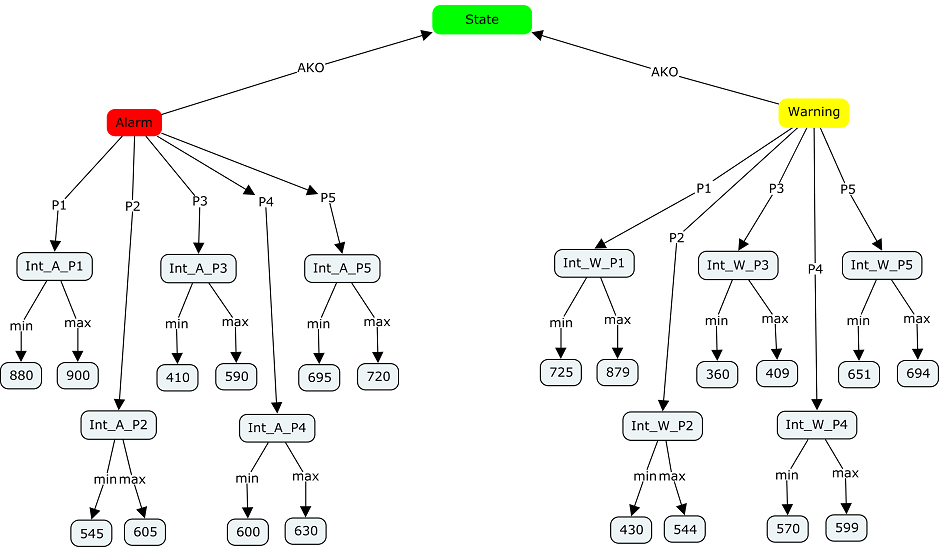

# Knowledge Base Represented by Semantic Web Language
Semantic Web languages OWL and RDF for Knowledge representation of Alarm-Warning System.

### Reference to:
[1] Valentyn N Sichkar. Semantic Web languages OWL and RDF for knowledge representation // GitHub platform [Electronic resource]. URL: https://github.com/sichkar-valentyn/Knowledge_Base_Represented_by_Semantic_Web_Language (date of access: XX.XX.XXXX)

## Description
The Semantic Web languages OWL and RDF enable knowledge representation by means of a Knowledge Base, i.e., a knowledge repository - not just a database. Knowledge Base consists of two parts: ontology and individuals, i.e., instances of classes in the ontology. Created Alarm-Warning System shows the statements of the System according to the values of sensors in given time. Types of used notations: _N3, json, latex, owl, owl Manchester, owl functional, rdf, turtle._

## Content
Codes (it'll send you to appropriate file):
* [N3_notation](https://github.com/sichkar-valentyn/Knowledge_Base_Represented_by_Semantic_Web_Language/blob/master/KB_in_Notation.n3)
* [triples](https://github.com/sichkar-valentyn/Knowledge_Base_Represented_by_Semantic_Web_Language/blob/master/KB_in_Triples)
* [json](https://github.com/sichkar-valentyn/Knowledge_Base_Represented_by_Semantic_Web_Language/blob/master/KB_in_json.owl)
* [latex](https://github.com/sichkar-valentyn/Knowledge_Base_Represented_by_Semantic_Web_Language/blob/master/KB_in_latex.owl)
* [owl](https://github.com/sichkar-valentyn/Knowledge_Base_Represented_by_Semantic_Web_Language/blob/master/KB_in_owl.owl)
* [owl_Manchester](https://github.com/sichkar-valentyn/Knowledge_Base_Represented_by_Semantic_Web_Language/blob/master/KB_in_owl_Manchester.owl)
* [owl_functional](https://github.com/sichkar-valentyn/Knowledge_Base_Represented_by_Semantic_Web_Language/blob/master/KB_in_owl_functional.owl)
* [rdf](https://github.com/sichkar-valentyn/Knowledge_Base_Represented_by_Semantic_Web_Language/blob/master/KB_in_rdf.owl)
* [turtle](https://github.com/sichkar-valentyn/Knowledge_Base_Represented_by_Semantic_Web_Language/blob/master/KB_in_turtle.owl)

 
Experimental results (figures on this page):

* <a href="#Concept map for organizing and representing knowledge">Concept map for organizing and representing knowledge</a>
* <a href="#Graphical representation of knowledge from .owl file with EasyRDF Converter">Graphical representation of knowledge from .owl file with EasyRDF Converter</a>

 
Theory (on this page):

* <a href="#Semantic Web Stack">Semantic Web Stack</a>
* <a href="#Uniform Resource Identifier">Uniform Resource Identifier</a>
* <a href="#Resource Description Framework RDF">Resource Description Framework RDF</a>
* <a href="#Resource Description Framework Schema RDFS">Resource Description Framework Schema RDFS</a>
* <a href="#Web ontology language">Web ontology language</a>
* <a href="#Descriptive logic and its application">Descriptive logic and its application</a>
* <a href="#Notations we can use in RDF">Notations we can use in RDF</a>
* <a href="#Terse RDF triple language (TURTLE) notation">Terse RDF triple language (TURTLE) notation</a>
* <a href="#SPARQL Protocol and RDF Query Language as protocol, data transmition schema">SPARQL Protocol and RDF Query Language as protocol, data transmition schema</a>
* <a href="#SPARQL language, types of query">SPARQL language, types of query</a>

 

### <a name="Concept map for organizing and representing knowledge">Concept map for organizing and representing knowledge</a>
Words on the line, referred to as linking words or linking phrases, specify the relationship between the two concepts.

### <a name="Graphical representation of knowledge from .owl file with EasyRDF Converter">Graphical representation of knowledge from .owl file with EasyRDF Converter</a>

### <a name="Semantic Web Stack">Semantic Web Stack</a>
The Semantic Web Stack (SWS) is illustration of the hierarchy of languages, where each layer uses capabilities of the layers below. It shows how technologies that are standardized and organized for Semantic Web (SW) to make the SW possible. The SW, from its side, provides a common framework that allows data to be shared and reused across application, enterprise, and community boundaries.

As shown in the SWS, the following languages or technologies are used to create SW. The technologies from the bottom of the stack up to OWL are currently standardized and accepted to build SW applications. It is still not clear how the top of the stack is going to be implemented.

### <a name="Uniform Resource Identifier">Uniform Resource Identifier</a>
A Uniform Resource Identifier (URI) is a sequence of characters that identifies a logical or physical resource. Such identification enables interaction with representations of the resource over a network. The URI generic syntax consists of a hierarchical sequence of five components:

URI = scheme:[//authority]path[?query][#fragment]

There are two types of URI:

* Uniform Resource Locator (URL)
* Uniform Resource Name (URN)

URL – this type of URI begins by stating which protocol should be used to locate and access the physical or logical resource on a network. If the resource is a web page, for example, the URI will begin with the protocol HTTP. For example, the URL http://example.org/sample/main_page.html refers to a resource identified as /sample/main_page.html whose representation is in the form of HTML and related code is obtainable via the Hypertext Transfer Protocol (http:) from a network host whose domain name is example.org.

URN – this type of URI labels the resource with a persistent, location-independent unique identifier. The URN will identify the resource throughout its lifecycle and will never change. Each URN has three components: the label “urn” a colon and a character string that serves as a unique identifier. For example, some book has its own ISBN number. The URN for that book can be:

urn:isbn:0-486-27557-4

### <a name="Resource Description Framework RDF">Resource Description Framework RDF</a>
Resource Description Framework (RDF) is a framework for creating statements in a form of so-called triples. It enables to represent information about resources in the form of graph - the semantic web is sometimes called Giant Global Graph.

RDF is based on the idea of making statements about resources (in particular web resources) in expressions of the form <b>subject–predicate–object</b>, known as triples. The subject denotes the resource, and the predicate denotes features of the resource, and expresses a relationship between the subject and the object. For example, one way to represent the notion "The sky has the color blue" in RDF is as the triple: a subject denoting "the sky", a predicate denoting "has the color", and an object denoting "blue".

Another example of RDF written in N3 notation:

@prefix : <http: www.example.org> .
 :john a :Person .
 :john :hasMother :helga .
 :john :hasFather :henrich .
 :richard :hasSister :jane .

The set of RDF-statements forms an oriented graph in which the vertices are subjects and objects, and the edges represent relations. However, in practice, RDF data is often stored in relational database or native representations (also called Triplestores). To process RDF data, it is proposed to implement query languages, such as SPARQL.

### <a name="Resource Description Framework Schema RDFS">Resource Description Framework Schema RDFS</a>
Resource Description Framework Schema (RDF Schema) is a set of classes with certain properties using by RDF. It provides basic elements for the description of ontologies, otherwise called RDF vocabularies, intended to structure RDF resources. These resources can be saved in a Triplestore to reach them with the query language SPARQL. Using RDFS it is for example possible to create hierarchies of classes and properties.

A typical example of an <b>rdfs:Class</b> is <b>foaf:Person</b> in the Friend of a Friend (FOAF) vocabulary. An instance of <b>foaf:Person</b> is a resource that is linked to the class <b>foaf:Person</b> using the <b>rdf:type</b> property, such as in the following formal expression of the natural-language sentence: 'John is a Person'.

ex:John rdf:type foaf:Person

Properties are instances of the class <b>rdf:Property</b> and describe a relation between subject resources and object resources. For example, the following declarations are used to express that the property <b>ex:employer</b> relates a subject, which is of type <b>foaf:Person</b>, to an object, which is of type foaf:Organization:

ex:employer rdfs:domain foaf:Person
 ex:employer rdfs:range foaf:Organization

Another example about dogs and cats is shown on the figure below.

Popular RDF vocabularies represented in RDFS include:

* FOAF
* Dublin Core
* Schema.org
* Simple Knowledge Organization System (SKOS)

### <a name="Web ontology language">Web ontology language</a>
Web Ontology Language (OWL) extends RDFS by adding more advanced constructs to describe semantics of RDF statements. It allows stating additional constraints, such as for example restrictions of values. It is based on description logic and so brings reasoning power to the semantic web.

On the basis of the language is the representation of reality in the <b>“object-property”</b> data model. OWL is suitable for describing not only web pages, but also any objects of reality. Each element of the description in this language (including the properties that connect the objects) is mapped to a URI (Uniform Resource Identifier).

The data described by an ontology in the OWL family is interpreted as a set of <b>"individuals"</b> and a set of <b>"property assertions"</b> which relate these individuals to each other.

Consider an ontology based on a description of a person. First, ontology identifiers are needed. Every OWL ontology must be identified by a URI (http://www.example.org/tea.owl, say). This example provides a sense of the Turtle syntax.

@prefix eric:    <http://www.example.org/people #> .
 @prefix contact: <http://www.example/contact#> .
 @prefix rdf:     <http://www.example.org/rdf#> .
 eric:me contact:fullName "Eric Miller" .
 eric:me contact:mailbox <mailto:e.miller123(at)example> .
 eric:me contact:personalTitle "Dr." .
 eric:me rdf:type contact:Person .

At the moment, the second version of the OWL language is considered to be relevant, which defines the following varieties:

* OWL Lite was originally intended to support those users primarily needing a classification hierarchy and simple constraints.
* OWL DL is designed to provide the maximum expressiveness possible while retaining computational completeness.
* OWL Full is based on a different semantics from OWL Lite or OWL DL, and was designed to preserve some compatibility with RDF Schema.

### <a name="Descriptive logic and its application">Descriptive logic and its application</a>
Description logics (DL) are a family of formal knowledge representation languages. A DL simulates concepts, roles and individuals, and their relationships. The fundamental modeling concept of a DL is the axiom - a logical statement relating roles and concepts. The basic formalism of DL by way of a prototypical example -  it first introduces the formalism for describing concepts (i.e., the description language), and then defines the terminological (TBox) and the assertional (ABox) formalisms. Next, it introduces the basic reasoning problems and shows how they are related to each other. Finally, it defines the rule language that is available in many of the implemented DL systems.

Architecture of a knowledge representation system based on Description Logics is shown on the figure above.

DLs are used in artificial intelligence to describe and reason about the relevant concepts of an application domain (known as terminological knowledge). It is of particular importance in providing a logical formalism for ontologies and the Semantic Web. OWL and its profile is based on DLs. The most notable application of DLs and OWL is in biomedical informatics where DL assists in the codification of biomedical knowledge.

Also, DLs have been used in a range of applications, e.g., configuration, and reasoning with database schemas and queries. They are, however, best known as the basis for ontology languages such as OIL, DAML+OIL and OWL. As well as DLs providing the formal underpinnings for these languages (i.e., a declarative semantics), DL systems are widely used to provide computational services for a rapidly expanding range of ontology tools and applications.

### <a name="Notations we can use in RDF">Notations we can use in RDF</a>
In computer science, in the context of data storage, serialization is the process of translating data structures or object state into a format that can be stored (for example, in a file or memory buffer) or transmitted (for example, across a network connection link) and reconstructed later (possibly in a different computer environment). When the resulting series of bits is reread according to the serialization format, it can be used to create a semantically identical clone of the original object.

Several common serialization formats (so called Notations) are in use for Resource Description Framework (RDF), including:

* Turtle - a compact, human-friendly format.
* N-Triples - a very simple, easy-to-parse, line-based format that is not as compact as Turtle.
* N-Quads - a superset of N-Triples, for serializing multiple RDF graphs.
* JSON-LD - a JSON-based serialization.
* N3 or Notation3 - a non-standard serialization that is very similar to Turtle, but has some additional features, such as the ability to define inference rules.
* RDF/XML - an XML-based syntax that was the first standard format for serializing RDF.
* RDF/JSON - an alternative syntax for expressing RDF triples using a simple JSON notation.

Let’s consider example with Turtle notation.

Turtle (Terse RDF Triple Language) is a format for expressing data in the Resource Description Framework (RDF) data model with a syntax similar to SPARQL. RDF, in turn, represents information using "triples", each of which consists of a subject, a predicate, and an object. Each of those items is expressed as a Web URI.
The following example defines 3 prefixes ("rdf", "dc" and "ex"), and uses them in expressing a statement about the editorship of the RDF/XML document:

@prefix rdf: <http://ex.org/rdf#> .
 @prefix dc: <http://ex.org/dc#> .
 @prefix ex: <http://ex.org/people#> .
 ex:me rdf:type ex:Person .
 ex:me dc:title "Tony Benn" .
 ex:me dc:publisher "Wikipedia" .
   
Turtle provides a way to group three URIs to make a triple, and provides ways to abbreviate information. Filename extension is - .ttl

### <a name="Terse RDF triple language (TURTLE) notation">Terse RDF triple language (TURTLE) notation</a>
Turtle (Terse RDF Triple Language) is a format for expressing data in the Resource Description Framework (RDF) data model with a syntax similar to SPARQL. RDF, in turn, represents information using "triples", each of which consists of a subject, a predicate, and an object. Each of those items is expressed as a Web URI.

Turtle provides a way to group three URIs to make a triple, and provides ways to abbreviate such information, for example by factoring out common portions of URIs. SPARQL, the query language for RDF, uses a syntax similar to Turtle for expressing query patterns.
  
Turtle provides a way to group three URIs to make a triple, and provides ways to abbreviate information. The example encodes an RDF graph made of three triples.

* Filename extension - .ttl
* Internet media type - text/turtle
* Developed by - Dave Beckett
* Type of format - Semantic Web
* Container for - RDF data
* Extended from - N-Triples

### <a name="SPARQL Protocol and RDF Query Language as protocol, data transmition schema">SPARQL Protocol and RDF Query Language as protocol, data transmition schema</a>
SPARQL Protocol and RDF Query Language (SPARQL) is an acronym standing in for both the query language itself, and the protocol through which operators use it. Human operators use SPARQL to make queries and retrieve information from data that is stored in a Resource Description Framework (RDF) format. RDF is a standard designed by the W3C for the exchange of data over the internet.

So, SPARQL Protocol and RDF Query Language (SPARQL) is a query language and protocol for RDF. SPARQL Protocol is described in two ways: first, as an abstract interface independent of any concrete realization, implementation, or binding to another protocol; second, as HTTP and SOAP bindings of this interface. SPARQL Protocol contains one interface, SparqlQuery, which in turn contains one operation, query. SPARQL Protocol is described abstractly with WSDL 2.0 in terms of a web service that implements its interface, types, faults, and operations, as well as by HTTP and SOAP bindings.

Data transmition schema is shown on the figure below.

In the case of queries that read data from the database, the SPARQL language specifies four different query variations for different purposes.

The General scheme of SPARQL-SELECT query looks like this:

<b>PREFIX</b>
   // prefix declarations - used to specify the abbreviations of universal resource identifiers (URIs).

<b>FROM ...</b>
   // the sources of the request to determine which RDF graphs are queried.

<b>SELECT ...</b>
   // result composition - defines the data elements to be returned.

<b>WHERE {...}</b>
   // query template - defines what to query from the dataset.

<b>ORDER BY ...</b>
   // the modifiers of the query, restrict, regulate, transform the query results.

### <a name="SPARQL language, types of query">SPARQL language, types of query</a>
SPARQL is an RDF query language, that is, a semantic query language for databases, able to retrieve and manipulate data stored in Resource Description Framework (RDF) format.

In the case of queries that read data from the database, the SPARQL language specifies four different query variations for different purposes:

* SELECT query. Used to extract raw values from a SPARQL endpoint, the results are returned in a table format.
* CONSTRUCT query. Used to extract information from the SPARQL endpoint and transform the results into valid RDF.
* ASK query. Used to provide a simple True/False result for a query on a SPARQL endpoint.
* DESCRIBE query. Used to extract an RDF graph from the SPARQL endpoint, the content of which is left to the endpoint to decide based on what the maintainer deems as useful information.

Each of these query forms takes a WHERE block to restrict the query, although, in the case of the DESCRIBE query, the WHERE is optional.
SPARQL query example that models the question "What are all the country capitals in Africa?":

PREFIX ex: <http://example.com/exampleOntology#>
 SELECT ?capital ?country
 WHERE
   {
     ?x  ex:cityname ?capital ;
           ex:isCapitalOf ?y .
     ?y  ex:countryname ?country ;
           ex:isInContinent  ex:Africa  .
   }

Variables are indicated by a "?" or "$" prefix. Bindings for ?capital and the ?country will be returned. The SPARQL query processor will search for sets of triples that match these four triple patterns, binding the variables in the query to the corresponding parts of each triple.

Another example with using filter:

SELECT distinct ? Name_foaf  ?Length  ?Rivers
 FROM <http://dbpedia.org>
 WHERE
 {
 ?Rivers a dbo:River.
 ?Rivers foaf:name ?Name_foaf.
 ?Rivers dbo:length ?Length filter (?Length < 1000).
 }
 LIMIT 100

From dbpedia.org this query will show 100 rivers which distance is shorter then 1000 km.

## MIT License
## Copyright (c) 2017 Valentyn N Sichkar
## github.com/sichkar-valentyn
### Reference to:
[1] Valentyn N Sichkar. Semantic Web languages OWL and RDF for knowledge representation // GitHub platform [Electronic resource]. URL: https://github.com/sichkar-valentyn/Knowledge_Base_Represented_by_Semantic_Web_Language (date of access: XX.XX.XXXX)
